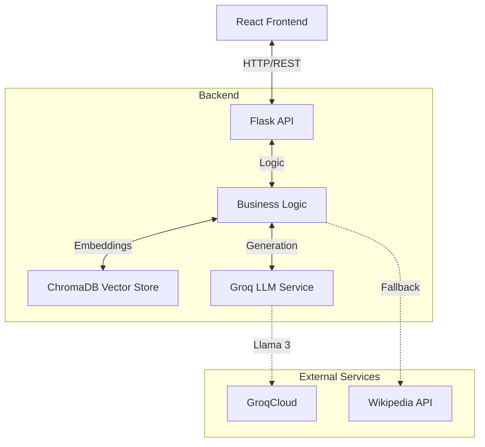

# 🎓 Smart-campus-assistant

> **From Chaos to Clarity.** An AI-powered study companion that transforms your lecture slides, notes, and documents into an interactive learning experience using RAG (Retrieval Augmented Generation).


## 🌟 Features

- **📂 Document Intelligence:** Upload PDFs, DOCX, PPTX, and TXT files. The system "reads" and understands them.
- **💬 AI Chat:** Ask questions and get answers grounded *strictly* in your uploaded materials (no hallucinations).
- **📝 Summary Generator:** Instantly create structured study guides and summaries for any topic in your course.
- **🧠 Quiz Mode:** Test your knowledge with AI-generated multiple-choice questions based on your actual notes.
- **🌐 Wikipedia Fallback:** If the answer isn't in your files, the system intelligently searches Wikipedia to get you started.
- **⚡ Fast & Responsive:** Powered by Groq for near-instant inference and built with a modern React frontend.

---

## 🏗️ System Architecture

High-level overview of how the Frontend, Backend, and AI components interact.



### Detailed Component Flow
```
┌─────────────────────────────────────────────────────────────────┐
│                     React Frontend (Port 3000)                   │
│  ┌───────────────────────────────────────────────────────────┐  │
│  │  Components:                                              │  │
│  │  - FileUpload        - ChatInterface                      │  │
│  │  - DocumentList      - SummaryGenerator                   │  │
│  │  - QuizGenerator     - ConversationHistory                │  │
│  └───────────────────────────────────────────────────────────┘  │
└─────────────────────────────────────────────────────────────────┘
                              ↓↑ HTTP/REST API
┌─────────────────────────────────────────────────────────────────┐
│                   Flask Backend (Port 5000)                      │
│  ┌───────────────────────────────────────────────────────────┐  │
│  │  API Endpoints:                                           │  │
│  │  /api/status, /api/upload_files, /api/ask                │  │
│  │  /api/summarize, /api/quiz                               │  │
│  └───────────────────────────────────────────────────────────┘  │
│  ┌───────────────────────────────────────────────────────────┐  │
│  │  RAG System (The Brain)                                  │  │
│  │  - Embeddings: HuggingFace (all-MiniLM-L6-v2)            │  │
│  │  - Vector Store: ChromaDB                                │  │
│  │  - LLM: Groq (llama-3.1-8b-instant)                      │  │
│  └───────────────────────────────────────────────────────────┘  │
└─────────────────────────────────────────────────────────────────┘
```

## 🔄 User Journey Flow

```
1. Upload Documents (PDF/DOCX/PPTX)
   │
   ├─► Backend processes files
   ├─► Extracts text & creates chunks
   ├─► Generates Vector Embeddings
   └─► Stores in ChromaDB
   
2. Ask Question / Summarize
   │
   ├─► User query sent to Backend
   ├─► System creates query embedding
   ├─► Searches Vector DB for relevant context
   ├─► Retrieves top matching chunks
   │
   └─► LLM generates answer using Context + Query
       (With fallback to Wikipedia if no docs found)
```

---

## 🛠️ Tech Stack

**Frontend:**
- React (Vite)
- TypeScript
- Tailwind CSS (Styling)
- Framer Motion (Animations)
- Lucide React (Icons)

**Backend:**
- Python 3.10+
- Flask (API Server)
- LangChain (LLM Orchestration)
- ChromaDB (Vector Database)
- Groq API (Llama 3.1-8b-instant LLM)
- HuggingFace Embeddings (`all-MiniLM-L6-v2`)

---

## 🚀 Getting Started

Follow these instructions to set up the project locally.

### Prerequisites
- Node.js (v18+)
- Python (v3.10+)
- A [Groq API Key](https://console.groq.com/keys) (Free)

### 1️⃣ Backend Setup

1.  **Navigate to the backend directory:**
    ```bash
    cd backend
    ```

2.  **Create a virtual environment:**
    ```bash
    python -m venv venv
    
    # Windows
    .\venv\Scripts\activate
    
    # Mac/Linux
    source venv/bin/activate
    ```

3.  **Install dependencies:**
    ```bash
    pip install -r ../requirements.txt
    ```

4.  **Configure Environment:**
    Create a `.env` file in the `backend` folder and add your API keys:
    ```env
    GROQ_API_KEY=your_groq_api_key_here
    ```

5.  **Run the Server:**
    ```bash
    python app.py
    ```
    *The backend will start on `http://localhost:5000`*

### 2️⃣ Frontend Setup

1.  **Navigate to the frontend directory:**
    ```bash
    cd frontend
    ```

2.  **Install dependencies:**
    ```bash
    npm install
    ```

3.  **Run the Development Server:**
    ```bash
    npm run dev
    ```
    *The application will open at `http://localhost:5173`*

---

## 📖 Usage Guide

1.  **Upload:** Click the upload box to select your study materials (Lecture slides, PDFs, etc.).
2.  **Chat:** Go to the Chat tab and ask, "What is the main concept in Week 3?".
3.  **Summarize:** Switch to the Summary tab, type "Neural Networks", and get a revision sheet.
4.  **Quiz:** Go to the Quiz tab to generate practice questions.

---

## 🤝 Contributing

Contributions are welcome! Please feel free to submit a Pull Request.

1.  Fork the project
2.  Create your feature branch (`git checkout -b feature/AmazingFeature`)
3.  Commit your changes (`git commit -m 'Add some AmazingFeature'`)
4.  Push to the branch (`git push origin feature/AmazingFeature`)
5.  Open a Pull Request